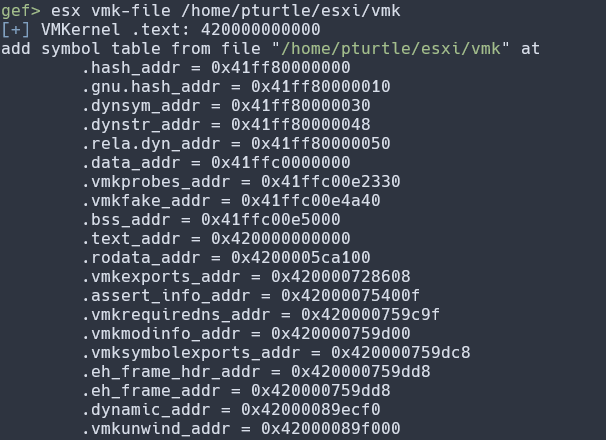
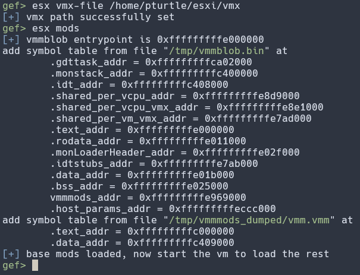
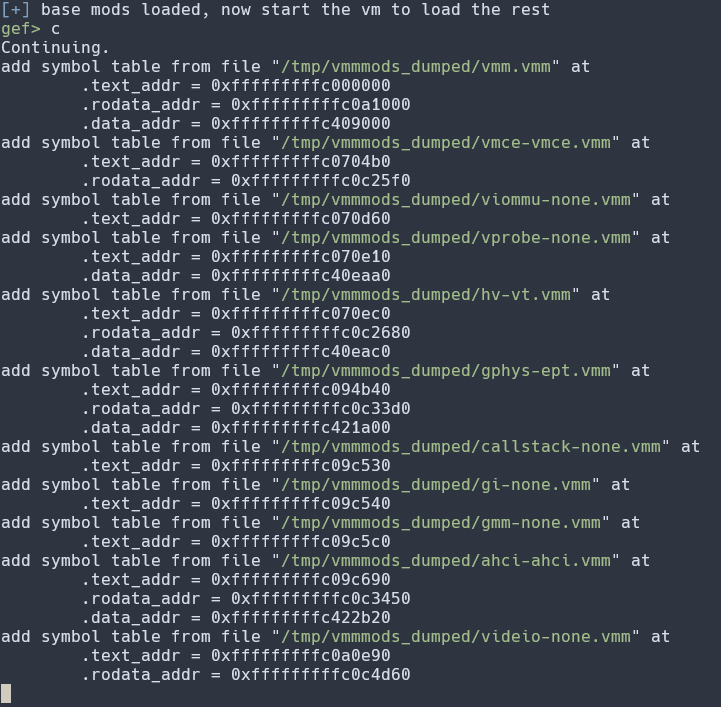
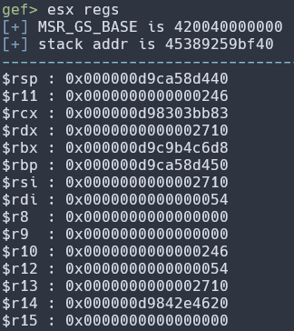

# gef-esxi

This is the GDB extension that enables comfortable ESXi debugging. It is based on [bata24-gef](https://github.com/bata24/gef). 

## Installation

To install gef-esxi you need to install both bata24-gef and gef-esxi:

```bash
wget -q https://raw.githubusercontent.com/bata24/gef/dev/install-uv.sh -O- | sudo sh
wget -q https://raw.githubusercontent.com/PavelBlinnikov/gef-esxi/main/install.sh -O- | sudo sh
```

## Features

- `esx vmk-file filepath`: adds VMKernel symbols
    - 

- `esx mods`: adds basic modules' symbols (vmmblob and vmm)
    - 
    - on vm startup loads secondary modules' symbols
        - 
- `esx regs`: prints userspace registers on syscall entry
    - 
